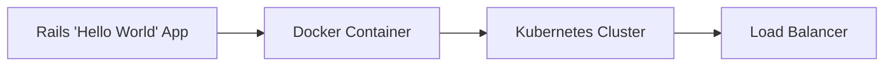

# Hello World Kubernetes Deployment

## Overview

This project implements a Rails application that responds with "Hello World" to all web requests. The application is containerized with Docker and deployed to Kubernetes using Helm charts.

## Architecture




* Rails Application: A simple Ruby on Rails application that returns "Hello World" for all requests
* Docker Container: Packages the Rails application with all dependencies
* Kubernetes Cluster: Manages the containerized application with 2 replicas for high availability
* Helm Charts: Provides templated Kubernetes manifests for easier deployment and management
* Terraform: Orchestrates the entire infrastructure, including the Kubernetes cluster

## Prerequisites

* Docker
* Minikube (for local development) or access to a Kubernetes cluster
* Helm 3+
* Terraform (for future infrastructure orchestration)

## Local Development Instructions

###  Building and Running with Docker

Build the Docker image and configure Minikube to use local images:

```
$ make docker-build
```

This command executes the following operations:

1. Starts Minikube if not already running
2. Sets Docker environment to use Minikube's Docker daemon
3. Builds the Docker image with the Rails application

To run the Docker container locally without Kubernetes:

```
$ make docker-run
```

### Deploying with Helm

Our Helm chart configures a Kubernetes deployment with 2 replicas of the Hello World application. Deploy to your Minikube cluster with:

```
$ make helm-install
```
The Helm chart includes:

* A Deployment with 2 replicas
* A Service to expose the application
* Resource limits and requests for proper scaling
* It's possible to add Ingress in the future

### Accessing the Service

Expose and access the service in your web browser:

```
make expose-service
```

This command creates a tunnel to the Kubernetes service and opens your default browser to access the Hello World application.

### Cleanup

```
$ make helm-delete
$ minikube pause

```
