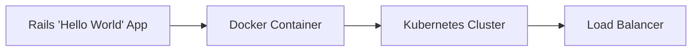

# Hello World Kubernetes Deployment

## Overview

This project implements a Rails application that responds with "Hello World" to all web requests. The application is containerized with Docker and deployed to Kubernetes using Helm charts. This document also outlines how Terraform would be used to orchestrate the infrastructure in a production environment.

## Architecture




* Rails Application: A simple Ruby on Rails application that returns "Hello World" for all requests
* Docker Container: Packages the Rails application with all dependencies
* Kubernetes Cluster: Manages the containerized application with 2 replicas for high availability
* Helm Charts: Provides templated Kubernetes manifests for easier deployment and management
* Terraform: Orchestrates the entire infrastructure, including the Kubernetes cluster

## Prerequisites

* Docker
* Minikube (for local development) or access to a Kubernetes cluster
* Helm 3+
* Terraform (for future infrastructure orchestration)

## Local Development Instructions

###  Building and Running with Docker

Build the Docker image and configure Minikube to use local images:

```
$ make docker-build
```

This command executes the following operations:

1. Starts Minikube if not already running
2. Sets Docker environment to use Minikube's Docker daemon
3. Builds the Docker image with the Rails application

To run the Docker container locally without Kubernetes:

```
$ make docker-run
```

### Deploying with Helm

Our Helm chart configures a Kubernetes deployment with 2 replicas of the Hello World application. Deploy to your Minikube cluster with:

```
$ make helm-install
```
The Helm chart includes:

* A Deployment with 2 replicas
* A Service to expose the application
* Resource limits and requests for proper scaling
* It's possible to add Ingress in the future

### Accessing the Service

Expose and access the service in your web browser:

```
make expose-service
```

This command creates a tunnel to the Kubernetes service and opens your default browser to access the Hello World application.

### Cleanup

```
$ make helm-delete
$ minikube pause

```

# Next steps

## Production Environment Considerations

* Ingress Controller: Implement NGINX or AWS ALB Ingress Controller for efficient traffic management
* Security: Configure Web Application Firewall (WAF) rules and SSL certificates
* Secret Management: Establish secure secret management with HashiCorp Vault or AWS Systems Manager Parameter Store
* CI/CD Pipeline: Set up automated pipelines for image building, terraform, and helm

## Future Terraform Implementation Plan

While not yet implemented, Terraform would be the preferred method to orchestrate the infrastructure in a production environment. This section outlines the planned approach.
Terraform Architecture (Proposed)
The Terraform configuration would be organized as follows:

```
terraform/
├── main.tf    
├── variables.tf   
├── outputs.tf    
├── kubernetes.tf
├── environments/
│   ├── dev.tfvars
│   ├── stage.tfvars
│   └── prod.tfvars
└── modules/
    ├── eks/
    ├── networking/
    └── storage/
```

In a production environment, Terraform would provision:

* An AWS EKS Kubernetes cluster
* Networking infrastructure (VPC, subnets, security groups)
* Load balancer for exposing the service
* S3 bucket for Terraform state storage

### Managing Terraform State for Multiple Environments

For managing multiple environments (development, staging, production), I would use Terraform workspaces. This approach provides several advantages:

* Isolation: Each environment has its own state file, preventing cross-environment modifications
* Consistency: The same Terraform code base is used across environments, ensuring configuration parity
* Environment-specific variables: Different parameters can be applied through environment-specific .tfvars files
* Simplified workflow: Developers can easily switch between environments using workspace commands

The workflow would look something like this:

```
# Create workspaces for different environments
$ terraform workspace new dev
$ terraform workspace new stage
$ terraform workspace new prod

# Select workspace before applying changes
$ terraform workspace select prod
$ terraform apply -var-file=environments/prod.tfvars
```

The Terraform state files would be stored in an S3 backend with DynamoDB for state locking to ensure collaborative work can happen safely:

```
terraform {
  backend "s3" {
    bucket         = "hello-world-terraform-state"
    key            = "terraform.tfstate"
    region         = "us-west-2"
    encrypt        = true
    dynamodb_table = "terraform-lock-table"
  }
}
```

### Managing Terraform Variables and Secrets

For variable and secret management, I would implement a multi-layered approach:

1. Variable Files for Environment-Specific Configuration: Using different .tfvars files for each environment allows for tailored configurations while keeping the underlying Terraform code consistent.
Example of how environment-specific variables would be structured:

```
# prod.tfvars
environment     = "production"
region          = "us-west-2"
instance_type   = "t3.medium"
replica_count   = 2
```

2. External Secret Management: For sensitive information, I would use AWS Secrets Manager or HashiCorp Vault instead of storing secrets in Terraform files or state.
Terraform would access these secrets as needed:

```
# Example of how secrets would be accessed (not implemented yet)
data "aws_secretsmanager_secret_version" "db_credentials" {
  secret_id = "db-credentials-${var.environment}"
}
```

This keeps sensitive data out of version control and Terraform state files, enhancing security.

## Monitoring Strategy

To ensure reliability and performance, I've would keep track of the following metrics.

### Key Metrics to Collect

* Kubernetes: kube_node_status_condition, kube_pod_status_phase, kube_deployment_status_replicas

* Application Performance: http_requests_total, http_request_duration_seconds, process_cpu_seconds_total

* Infrastructure Health (Future Terraform-managed resources): aws_eks_cluster_status, aws_instance_cpu_utilization, aws_s3_bucket_size_bytes

* Helm Deployment Health: helm_release_info, helm_release_info, kubernetes_container_memory_usage_bytes


### Recommended Monitoring Tools

* Metrics Collection and Visualization: Prometheus with Grafana dashboards
* Log Management: Loki for aggregation and searching
* Alerting: Alertmanager for anomaly detection and notifications
* Full-Stack Observability (alternative to all above): New Relic or Datadog

## Testing 

A comprehensive testing strategy would ensure the reliability and correctness of the infrastructure.

### Infrastructure Testing

#### Terraform Testing (Future Implementation)

* Syntax and Validation: `terraform validate` to check for syntax errors
* Plan Review: `terraform plan` to ensure expected changes are made
* Automated Tests: Terratest to write automated infrastructure tests with terratest or standard terraform testing library

### Kubernetes Testing

* Deployment Validation: Check pod status with `kubectl get pods`
* Health Checks: Use Kubernetes probes (readiness and liveness probes)
* Diagnostics: Use `kubectl describe` to inspect issues with pods or services

### Application Testing

* Endpoint Testing: Send test requests with `curl http://<EXTERNAL-IP>`
* Log Analysis: Check application logs with `kubectl logs <pod-name>`
* Performance Testing: Use tools like k6 for load testing

### Helm Chart Testing

* Chart Validation: Use `helm lint` to check for syntax errors
* Template Verification: Use `helm template` to verify the rendered manifests
* Isolated Testing: Deploy in a test namespace with `helm install --namespace test`
* Rollback Testing: Test rollback functionality with helm rollback

### End-to-End Testing

* Deploy the complete stack in a staging environment
* Simulate real user traffic patterns
* Automate testing with CI/CD pipelines (GitHub Actions, GitLab CI, or Jenkins)